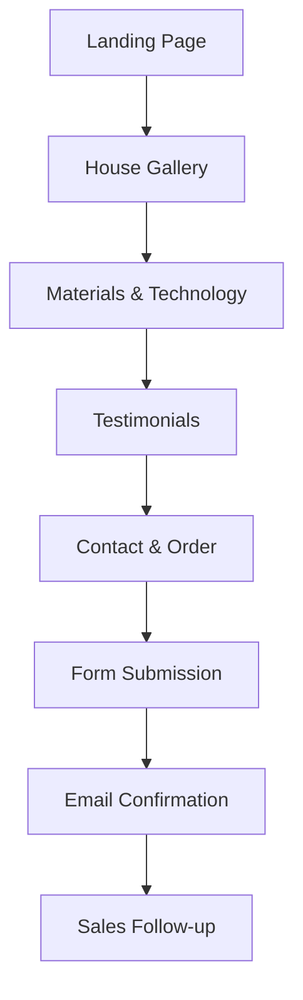

## 1. Product Overview

Modular House adalah website penjualan rumah box modern yang menawarkan hunian mewah dengan konsep modular dan bahan ramah lingkungan. Website ini menyediakan platform showcase untuk menampilkan desain rumah inovatif dengan fokus pada keberlanjutan dan estetika modern.

Target pasar: individu dan keluarga yang mencari hunian modern, investor properti, serta konsumen yang sadar lingkungan yang menginginkan rumah dengan desain kontemporer dan material eco-friendly.

## 2. Core Features

### 2.1 User Roles

| Role | Registration Method | Core Permissions |
|------|---------------------|------------------|
| Visitor | No registration required | Browse website content, view house designs, read testimonials |
| Potential Buyer | Contact form submission | Submit inquiries, request quotes, schedule consultations |
| Admin | Backend login | Manage content, testimonials, inquiries |

### 2.2 Feature Module

Website Modular House terdiri dari halaman-halaman utama berikut:

1. **Landing Page**: Hero section dengan showcase rumah, navigation menu, company overview
2. **House Gallery**: Portfolio desain rumah box dengan detail spesifikasi
3. **Materials & Technology**: Penjelasan bahan modern dan teknologi ramah lingkungan
4. **Testimonials**: Kumpulan testimoni pelanggan yang sudah menggunakan jasa
5. **Contact & Order**: Formulir kontak, pemesanan, dan konsultasi

### 2.3 Page Details

| Page Name | Module Name | Feature description |
|-----------|-------------|---------------------|
| Landing Page | Hero Section | Tampilkan gambar rumah utama dengan slider otomatis, headline value proposition, dan call-to-action button |
| Landing Page | Navigation Menu | Menu sticky header dengan smooth scroll ke section yang dituju, logo company, dan contact button |
| Landing Page | Company Overview | Deskripsi singkat tentang Modular House, keunggulan kompetitif, dan statistik penjualan |
| House Gallery | Design Showcase | Grid layout menampilkan koleksi desain rumah dengan gambar high-resolution, nama model, dan harga estimasi |
| House Gallery | Detail Modal | Popup detail untuk setiap desain mencakup spesifikasi teknis, material, timeline pembuatan, dan gallery foto 360° |
| Materials & Technology | Eco Materials | Penjelasan visual tentang bahan ramah lingkungan seperti solar panels, recycled steel, smart insulation |
| Materials & Technology | Modern Features | Showcase teknologi canggih: smart home integration, energy management, modular construction benefits |
| Testimonials | Customer Reviews | Card layout menampilkan foto pelanggan, rating bintang, testimoni teks, dan nama proyek yang diselesaikan |
| Contact & Order | Contact Form | Formulir multi-step untuk pertanyaan umum mencakup nama, email, phone, budget range, dan pesan detail |
| Contact & Order | Order Form | Formulir pemesanan dengan pilihan desain rumah, lokasi pengiriman, timeline preferensi, dan metode pembayaran |
| Contact & Order | Consultation Scheduler | Kalender interaktif untuk booking appointment virtual atau site visit |

## 3. Core Process

### Visitor Flow
Pengunjung website dapat menelusuri seluruh konten tanpa registrasi. Mereka diajak melihat showcase rumah di hero section, menjelajahi gallery desain, membaca tentang teknologi dan material eco-friendly, serta melihat testimoni pelanggan. Jika tertarik, mereka dapat mengisi contact form untuk konsultasi lebih lanjut.

### Potential Buyer Flow
Setelah mengisi formulir kontak, calon pembeli akan menerima email konfirmasi dan tim sales akan menghubungi untuk follow-up. Mereka dapat melakukan pemesanan melalui order form dan menjadwalkan konsultasi untuk diskusi detail proyek.

## 4. User Interface Design

### 4.1 Design Style

- **Primary Colors**: Deep Forest Green (#2D5016) untuk eco-friendly vibe, Warm White (#FAFAFA) untuk background
- **Secondary Colors**: Modern Grey (#4A5568), Accent Gold (#D4AF37) untuk elemen mewah
- **Button Style**: Rounded corners (8px radius), hover effects dengan shadow elevation
- **Typography**: Inter font family, heading 48px/40px/32px, body text 16px, small text 14px
- **Layout Style**: Card-based design dengan grid system, full-width hero sections, asymmetric layouts untuk visual interest
- **Icons**: Minimalist line icons dengan weight 2px, eco-themed icons untuk sustainability features

### 4.2 Page Design Overview

| Page Name | Module Name | UI Elements |
|-----------|-------------|-------------|
| Landing Page | Hero Section | Full-width background image dengan overlay gelap 40%, headline text putih 48px bold, CTA button gold dengan icon arrow right |
| House Gallery | Design Grid | Masonry layout 3 kolom desktop, 2 kolom tablet, 1 kolom mobile, card shadow on hover, lazy loading images |
| Materials & Technology | Feature Cards | Horizontal scrolling cards untuk mobile, grid 2x2 untuk desktop, icon besar 64px dengan animasi fade-in on scroll |
| Testimonials | Review Cards | Carousel dengan navigation dots, avatar bulat 80px, quote icon decorative, star rating dengan warna gold |
| Contact & Order | Form Sections | Multi-step form dengan progress indicator, input fields dengan border 2px, focus state dengan outline hijau |

### 4.3 Responsiveness

Website menggunakan pendekatan desktop-first dengan breakpoint:
- Desktop: 1280px and above
- Tablet: 768px - 1279px
- Mobile: 320px - 767px

Touch interaction dioptimalkan untuk mobile dengan button minimum 44px height, swipe gestures untuk gallery, dan tap targets yang sesuai standar accessibility.