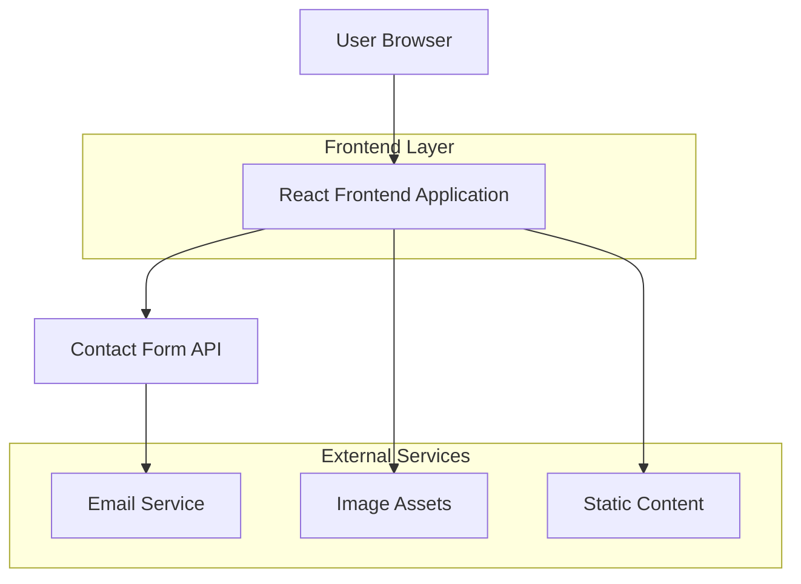

## 1. Architecture Design



## 2. Technology Description

- **Frontend**: React@18 + Tailwind CSS@3 + Vite
- **Initialization Tool**: vite-init
- **Backend**: None (Static Site)
- **Email Service**: EmailJS atau FormSubmit (untuk handling form submissions)
- **Image Optimization**: Vite Image Optimizer

## 3. Route Definitions

| Route | Purpose |
|-------|---------|
| / | Landing page utama dengan hero section dan company overview |
| /gallery | House Gallery page menampilkan portfolio desain rumah |
| /materials | Materials & Technology page menjelaskan eco-friendly materials |
| /testimonials | Testimonials page dengan customer reviews |
| /contact | Contact & Order page dengan formulir kontak dan pemesanan |

## 4. Component Architecture

### 4.1 Core Components

```typescript
// Layout Components
interface LayoutProps {
  children: React.ReactNode;
  className?: string;
}

// Hero Section Component
interface HeroProps {
  title: string;
  subtitle: string;
  backgroundImage: string;
  ctaText: string;
  ctaLink: string;
}

// House Card Component
interface HouseCardProps {
  id: string;
  title: string;
  image: string;
  price: string;
  specs: string[];
  description: string;
}

// Testimonial Card Component
interface TestimonialProps {
  name: string;
  avatar: string;
  rating: number;
  review: string;
  project: string;
}

// Contact Form Component
interface ContactFormData {
  name: string;
  email: string;
  phone: string;
  budget: string;
  message: string;
  houseModel?: string;
}
```

### 4.2 State Management

```typescript
// Gallery Filter State
interface GalleryState {
  houses: House[];
  filteredHouses: House[];
  selectedCategory: string;
  searchTerm: string;
}

// Form State
interface FormState {
  currentStep: number;
  formData: ContactFormData;
  isSubmitting: boolean;
  submitStatus: 'idle' | 'loading' | 'success' | 'error';
}
```

## 5. Static Data Structure

### 5.1 House Data

```typescript
interface House {
  id: string;
  title: string;
  model: string;
  images: string[];
  price: {
    min: number;
    max: number;
    currency: string;
  };
  specifications: {
    area: number;
    bedrooms: number;
    bathrooms: number;
    floors: number;
  };
  features: string[];
  materials: string[];
  description: string;
  completionTime: string;
}
```

### 5.2 Testimonial Data

```typescript
interface Testimonial {
  id: string;
  customerName: string;
  avatar: string;
  rating: number;
  review: string;
  projectName: string;
  completionDate: string;
  images: string[];
}
```

### 5.3 Materials Data

```typescript
interface Material {
  id: string;
  name: string;
  category: 'sustainable' | 'smart' | 'insulation' | 'structural';
  description: string;
  benefits: string[];
  ecoRating: number;
  image: string;
}
```

## 6. Performance Optimization

### 6.1 Image Optimization
- Implement lazy loading untuk gallery images
- Gunakan WebP format dengan fallback ke JPEG
- Responsive images dengan srcset untuk berbagai ukuran layar
- Preload hero images untuk LCP optimization

### 6.2 Code Splitting
- Lazy load route components menggunakan React.lazy()
- Code split berdasarkan routes
- Vendor chunk separation untuk better caching

### 6.3 Build Optimization
- Enable Vite's build.minify untuk production
- Implement service worker untuk offline capability
- Configure proper caching headers untuk static assets

## 7. SEO Configuration

### 7.1 Meta Tags
```typescript
interface SEOConfig {
  title: string;
  description: string;
  keywords: string[];
  ogImage: string;
  canonicalUrl: string;
}
```

### 7.2 Structured Data
- Implement JSON-LD untuk organization info
- Product schema untuk house listings
- Review schema untuk testimonials
- LocalBusiness schema untuk informasi kontak

## 8. Deployment Strategy

### 8.1 Build Process
```bash
# Development
npm run dev

# Production Build
npm run build

# Preview Production Build
npm run preview
```

### 8.2 Deployment Options
- **Netlify**: Drag & drop atau Git integration
- **Vercel**: Automatic deployments dari Git
- **GitHub Pages**: Static site hosting
- **Firebase Hosting**: CDN global dengan SSL otomatis

### 8.3 Environment Variables
```env
VITE_CONTACT_EMAIL=your-email@domain.com
VITE_EMAIL_SERVICE_ID=emailjs-service-id
VITE_EMAIL_TEMPLATE_ID=emailjs-template-id
VITE_EMAIL_PUBLIC_KEY=emailjs-public-key
VITE_GOOGLE_ANALYTICS_ID=ga-measurement-id
```

## 9. Development Workflow

### 9.1 Component Development
- Atomic design principle (atoms → molecules → organisms)
- Storybook untuk component documentation
- Unit testing dengan Vitest
- E2E testing dengan Cypress

### 9.2 Git Workflow
```
main (production)
  ↓
develop (integration)
  ↓
feature/feature-name (development)
```

### 9.3 Code Quality
- ESLint untuk code linting
- Prettier untuk code formatting
- Husky untuk pre-commit hooks
- Conventional commits untuk commit messages